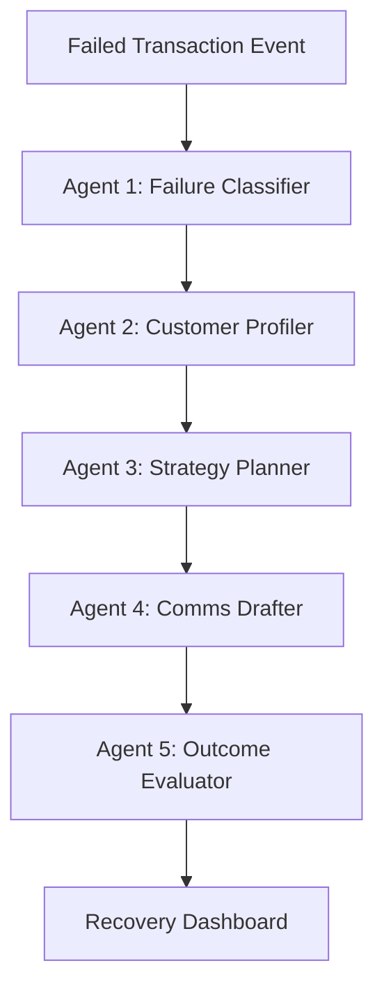

# ReviveAgent
> Autonomous multi-agent system for payment failure recovery.
> Built on LangGraph. Powered by Razorpay's test APIs.

## Status
**Agents 1–5 live** in one LangGraph loop (classify → profile → plan → draft → evaluate/learn).
React dashboard: Feed + Funnel + Agent Trace + Strategy Performance.

## Quick start

```bash
# 1. Copy env and add your Razorpay TEST keys + Gemini key
cp .env.example .env

# 2. Start Postgres + Redis + API
docker compose up --build

# 3. Smoke test
curl -s http://localhost:9000/health | jq
python scripts/simulate_failures.py

# 4. Dashboard
cd frontend && npm install && npm run dev
```

- API docs: http://localhost:9000/docs
- Dashboard: http://localhost:6100

## Agent Architecture



## Why This Matters for Razorpay
India's payment failures still get recovered by hand — bulk SMS, no personalization, no feedback loop.
ReviveAgent runs a full Perceive → Plan → Act → Evaluate loop with explainable agent traces.
Built by someone who already shipped Bridge (settlement calling orchestration) for NBFC recovery.
# Revive-agent
